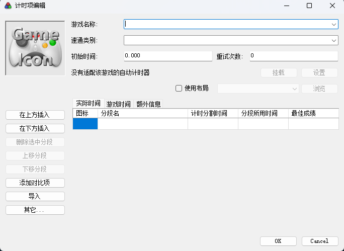
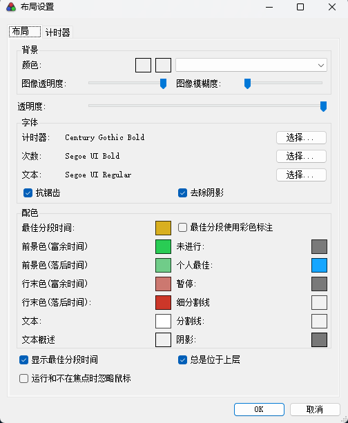
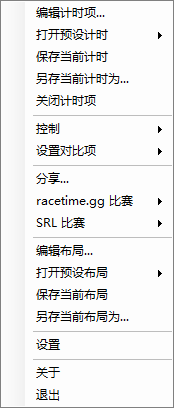

# LiveSplit 汉化

原版README见[LiveSplit](https://github.com/LiveSplit/LiveSplit)

# 更改

## 汉化相关

因为LiveSplit采用组件化的设计，汉化所有组件对我来说不可能，所以我只进行了一些核心汉化，对某些常用组件进行了汉化。





## 网络连接相关

LiveSplit会在启动时自动连接SpeedRunLive和racegame.gg的API(国内无法访问)，会大大降低启动速度，这里做了修改直接跳过这个过程。

其次，LiveSplit获取autoSpliters.xml文件直接走的原生github连接，我这里用jsdelivar的镜像代替，做到几乎秒开。

需要注意，LiveSplit还是会利用Speedruncom模块(见lib/SpeedrunComSharp)来获取游戏名的json文件，这个过程跳过不了而且没有代理，不过文件体积较小。

# 修改文件记录

## 汉化相关

```bash

LiveSplit.View\View\AboutBox.Designer.cs
LiveSplit.View\View\TimerForm.Designer.cs
LiveSplit.View\View\TimerForm.cs
LiveSplit.Core\Model\Run.cs
LiveSplit.Core\Model\Comparisons\BestSegmentsComparisonGenerator.cs
LiveSplit.Core\Model\Comparisons\AverageSegmentsComparisonGenerator.cs
LiveSplit.View\View\RunEditorDialog.Designer.cs
LiveSplit.View\View\RunEditorDialog.cs
LiveSplit.View\View\MetadataControl.Designer.cs
LiveSplit.View\View\EditHistoryDialog.Designer.cs
LiveSplit.View\View\SettingsDialog.Designer.cs
LiveSplit.View\View\ChooseComparisonsDialog.Designer.cs
LiveSplit.Core\Model\Comparisons\BestSplitTimesComparisonGenerator.cs
LiveSplit.Core\Model\Comparisons\LatestRunComparisonGenerator.cs
LiveSplit.Core\Model\Comparisons\MedianSegmentsComparisonGenerator.cs
LiveSplit.Core\Model\Comparisons\NoneComparisonGenerator.cs
LiveSplit.Core\Model\Comparisons\WorstSegmentsComparisonGenerator.cs
LiveSplit.View\View\LayoutEditorDialog.Designer.cs
LiveSplit.View\View\LayoutEditorDialog.cs
LiveSplit.View\View\LayoutSettingsDialog.Designer.cs
LiveSplit.View\View\LayoutSettingsControl.Designer.cs
LiveSplit.View\View\SetSizeForm.Designer.cs
LiveSplit.View\View\LayoutSettingsDialog.cs
```

## 网络相关

```bash
LiveSplit.Core\Web\SRL\SpeedRunsLiveAPI.cs
LiveSplit.Racetime\src\LiveSplit.Racetime\RacetimeAPI.cs

LiveSplit.Core\Model\AutoSplitterFactory.cs
```

## 组件相关

```bash
components\LiveSplit.Splits\src\LiveSplit.Splits\UI\Components\SplitsSettings.cs
components\LiveSplit.Splits\src\LiveSplit.Splits\UI\Components\SplitsSettings.Designer.cs
components\LiveSplit.Title\src\LiveSplit.Title\UI\Components\Title
components\LiveSplit.Splits\src\LiveSplit.Splits\UI\Components\ColumnSettings.Designer.cs
components\LiveSplit.Splits\src\LiveSplit.Splits\UI\Components\ColumnSettings.cs
components\LiveSplit.Timer\src\LiveSplit.Timer\UI\Components\Timer.cs
components\LiveSplit.Timer\src\LiveSplit.Timer\UI\Components\TimerSettings.Designer.cs
components\LiveSplit.PreviousSegment\src\LiveSplit.PreviousSegment\UI\Components\PreviousSegmentSettings.cs
components\LiveSplit.PreviousSegment\src\LiveSplit.PreviousSegment\UI\Components\PreviousSegmentSettings.Designer.cs
```